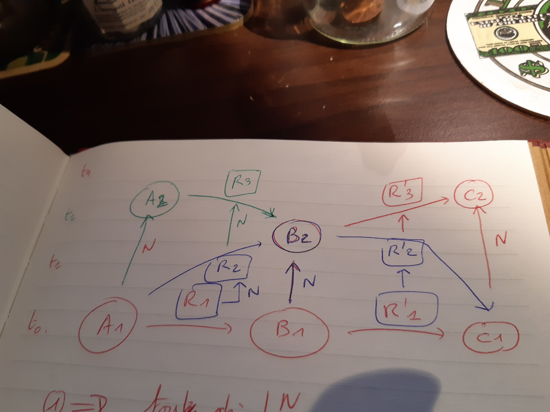
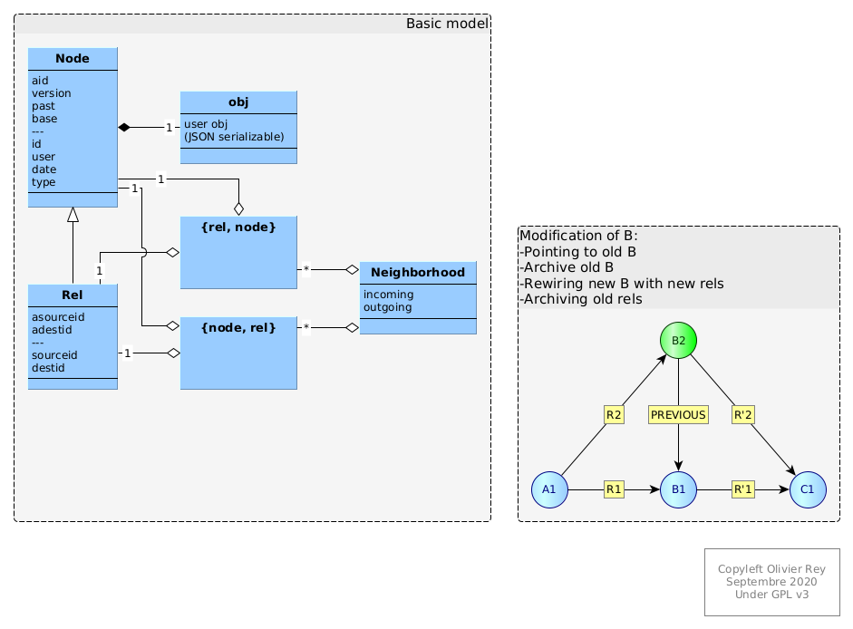

# Design indications

## Concept

## Overview

## Modifications management

There are no modifications in our DB, just clones of graph neighbourhoods.

### Node

**attribute** | **clone** | **comment**
--- | --- | ---
aid | new | unique ID
version | oldnode.version ++ | for users
past | false | true for oldnode
base | PRESENT | PAST for oldnode
id | keep the oldnode.id | The creation id will remain the user id "label of all versions"
user | keep the oldnode.user | 
date | the newnode keeps its own date | creation date of the new node 
type | keep the type the oldnode |
obj | replace the obj in new node |

### Rel

Incoming Rel

**attribute** | **clone** | **comment**
--- | --- | ---
aid | new | unique ID
version | oldnode.version ++ | for users
past | false | true for oldnode
base | PRESENT | PAST for oldnode
asourceid | keep for incoming |
adestid | newnode.aid | rewiring
id | keep the oldnode.id | The creation id will remain the user id "label of all versions"
user | keep the oldnode.user | 
date | the newnode keeps its own date | creation date of the new node 
type | keep the type the oldnode |
obj | replace the obj in new node |
source | links between user id labels, keep |
dest | links between user id labels, keep |

Outgoing Rel

**attribute** | **clone** | **comment**
--- | --- | ---
aid | new | unique ID
version | oldnode.version ++ | for users
past | false | true for oldnode
base | PRESENT | PAST for oldnode
asourceid | newnode.aid | rewiring
adestid | keep | 
id | keep the oldnode.id | The creation id will remain the user id "label of all versions"
user | keep the oldnode.user | 
date | the newnode keeps its own date | creation date of the new node 
type | keep the type the oldnode |
obj | replace the obj in new node |
source | links between user id labels, keep |
dest | links between user id labels, keep |

